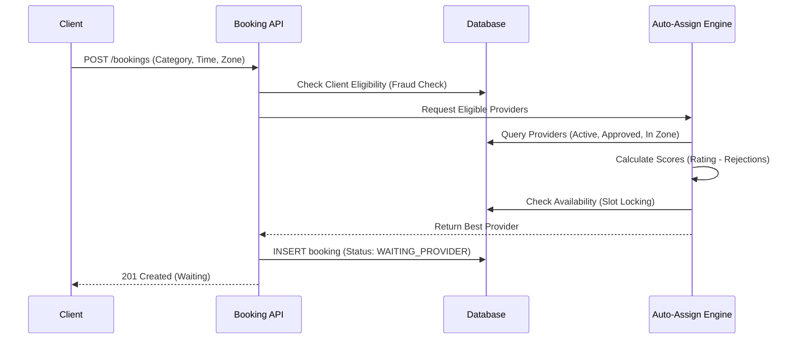
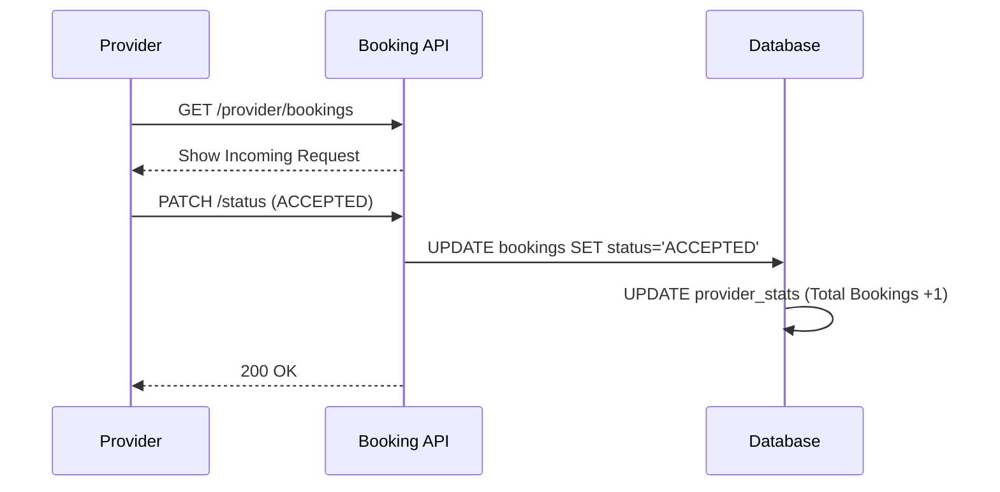
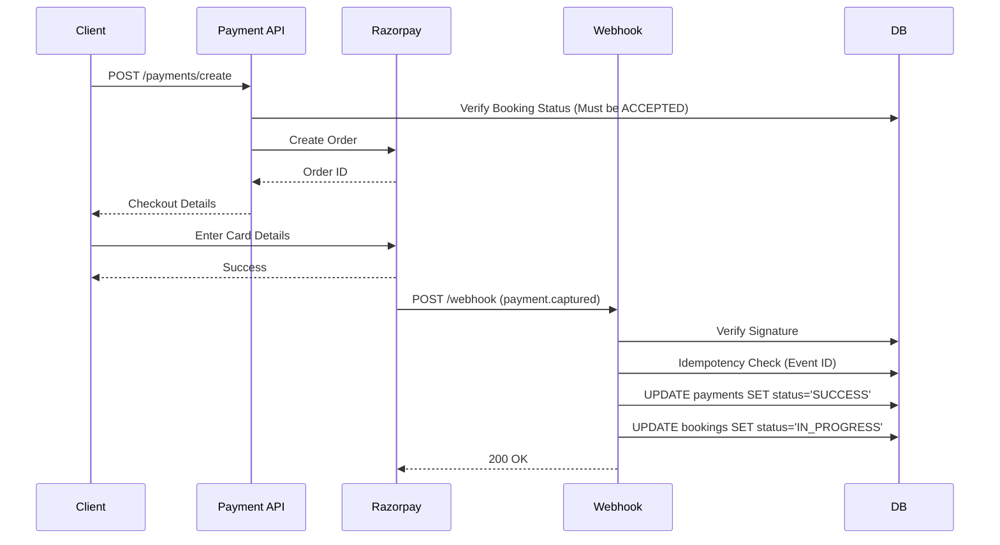
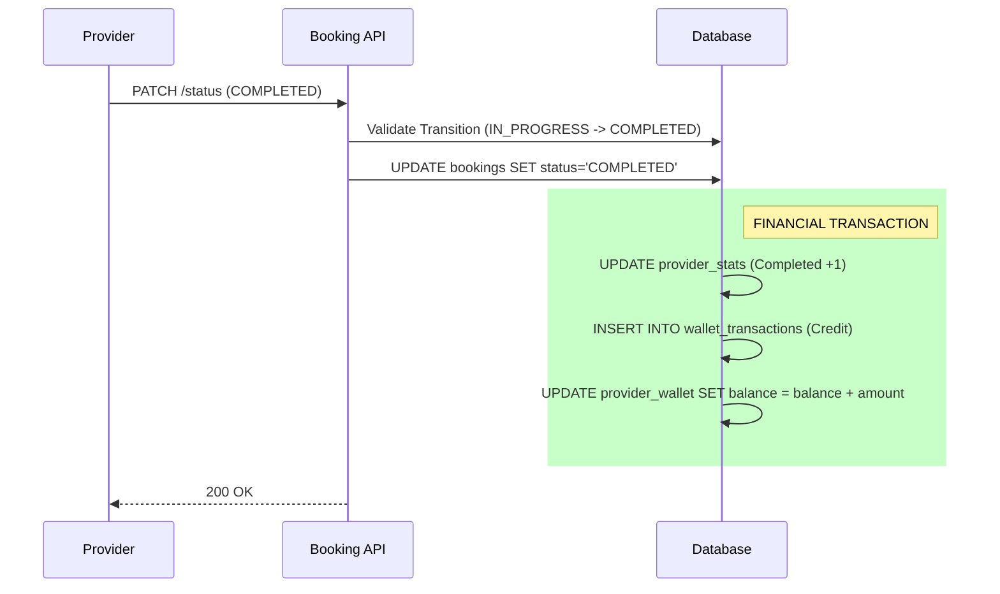

# 🔄 END-TO-END SEQUENCE DIAGRAM

## (Client → Booking → Payment → Provider → Wallet)

### 🧠 Core Principles
* **Client provider choose nahi karta** (System Auto-Assigns)
* **Payment sirf webhook se verify hota** (Zero Trust Frontend)
* **Wallet credit sirf COMPLETED par** (Escrow-like logic)

---

### 1. BOOKING CREATION FLOW

### 2. PROVIDER HANDSHAKE

### 3. PAYMENT FLOW (STRICT)

### 4. SETTLEMENT FLOW

---

### 🔒 SYSTEM GUARDS (IMPLEMENTED)

1. **One booking ↔ One payment**: Enforced via Unique Constraint on `payments.booking_id`.
2. **Slot Locking**: DB Query checks overlap before assigning provider.
3. **Webhook Idempotency**: `webhook_events` table prevents replay attacks.
4. **State Machine**: Code enforces strict transitions (e.g., cannot go PENDING -> COMPLETED).
